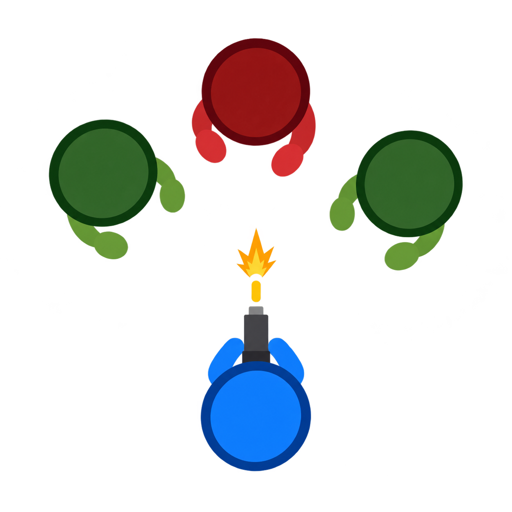
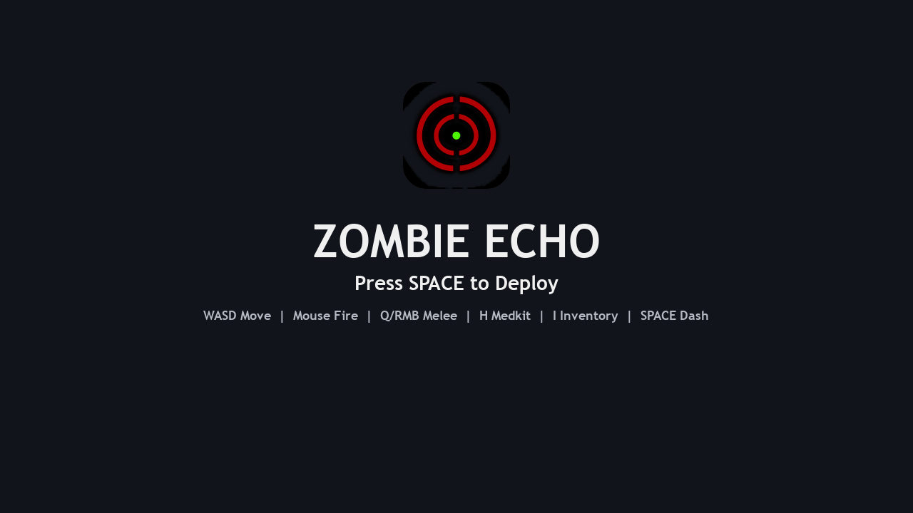
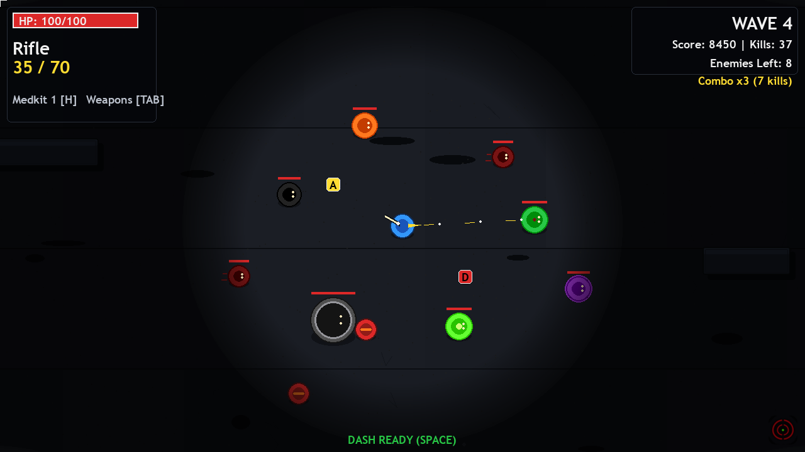
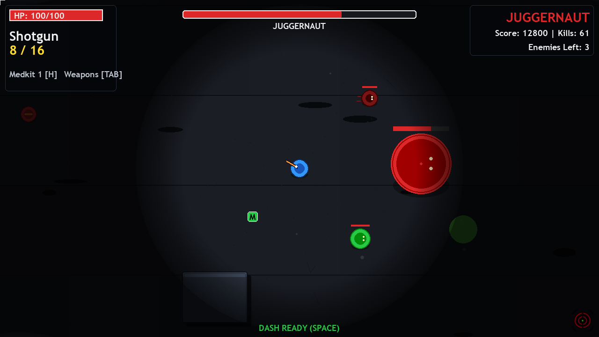

# Zombie Echo: Those Left in the Dark



Zombie Echo is a fast top-down arena shooter built with Pygame. Fight through
short, aggressive waves, turn close-range kills into momentum, collect new
weapons, and survive a rotating boss encounter every five waves.

## Screenshots







## Features

- Seven weapons: Pistol, Revolver, SMG, Rifle, Shotgun, LMG, and Launcher
- Three rotating bosses: Juggernaut, Broodmother, and Reaper
- Dash damage, melee executions, explosive barrels, and combo momentum
- Ammo, medkits, temporary boosts, weapon drops, and end-of-wave rewards
- Enemies that flank, keep distance, navigate around walls, and separate cleanly
- Layered player visibility with four sparse 300 px map lights
- Dark, readable presentation with restrained HUD, music, and sound effects
- No account, progression grind, rarity tiers, or level system

## Controls

| Input | Action |
| --- | --- |
| `WASD` | Move |
| Left mouse button | Fire |
| `R` | Reload |
| `1-7` / mouse wheel | Switch weapon |
| `SPACE` | Dash |
| `Q` / right mouse button | Melee |
| `H` | Use medkit |
| `I` / `TAB` | Open loadout |
| `E` | Pick up a weapon |
| `ESC` | Pause |

## Download

Windows x64, Linux x64, and Apple Silicon macOS builds are available from the
repository's [GitHub Releases](https://github.com/knorbay/Zombie-Echo/releases).
Mac users should right-click **Zombie Echo.app** and choose **Open** the first
time if macOS displays an unidentified developer warning.

## Run from source

```bash
python3 -m pip install -r requirements.txt
python3 main.py
```

## Build the macOS app

```bash
python3 -m pip install -r requirements.txt pyinstaller
pyinstaller --noconfirm ZombieEcho.spec
```

The application is created at `dist/Zombie Echo.app`.

## Credits

- Game design and development: knorbay
- Additional sound effects: [Kenney](https://kenney.nl/), CC0
